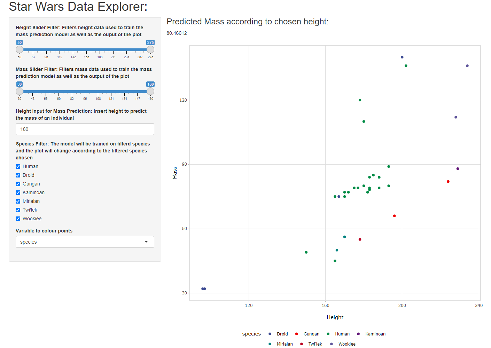

```{r setup, include=FALSE}
knitr::opts_chunk$set(echo = TRUE,eval=FALSE)
```

## Introduction

The following Star Wars data explorer can be found by visiting:<https://starwarsexplorer.shinyapps.io/shinyApp/>

The mass and height data used to train the mass prediction model and plot the points
can be filtered by using the slider inputs.  The model can also be trained for a specific
species and the point plotted for a specific species.

The points can also be coloured according to the individuals species or gender.

Once you are content with the data you can enter the height into the numeric input box and the mass will be predicted and indicated at the top of the plot.



## User Interface Code

```{r,eval=F}
# Define UI for application
shinyUI(fluidPage(
    headerPanel("Star Wars Data Explorer:"),
    sidebarPanel(
        sliderInput("height_slide",
                    "Height Slider Filter: Filters height data used to train the
                    mass prediction model as well as the ouput of the plot",
                    min = 50,
                    max = 275,
                    value = c(50,275)),
        sliderInput("mass_slide",
                    "Mass Slider Filter: Filters mass data used to train the mass
                    prediction model as well as the output of the plot",
                    min = 30,
                    max = 160,
                    value = c(30,160)),
        numericInput("height_input",
                     "Height Input for Mass Prediction: Insert height to predict
                     the mass of an individual",
                     value = 180),
        checkboxGroupInput('species_input', 
                           'Species Filter: The model will be trained on filterd species and the plot willchange
                           according to the filtered species chosen',
                           c("Human","Droid","Gungan","Kaminoan","Mirialan","Twi'lek","Wookiee"),
                           selected = c("Human","Droid","Gungan","Kaminoan","Mirialan","Twi'lek","Wookiee")),
        selectInput('colour', 'Variable to colour points', choices = c("gender","species"), selected = "species"),
        width = 3),
    h3("Predicted Mass according to chosen height: "),
    textOutput("pred"),
    mainPanel(
        plotlyOutput('trendPlot', height = "900px",width = "900px")
    )
))
```


## Server Code
```{r,eval=FALSE}
# Define server logic
shinyServer(function(input, output) {
    #add reactive data information. Dataset = Star Wars Data
    dataset <- reactive({
        data<-starwars%>%
            filter(species %in% input$species_input,
                   between(height,input$height_slide[1],input$height_slide[2]),
                   between(mass,input$mass_slide[1],input$mass_slide[2]))})
    model<-reactive({
        lm_mod<-lm(mass~height,data = dataset())})
    pred<-reactive({
        input<-input$height_input
        predict(model(),newdata=data.frame(height=input))
    })
    output$trendPlot <- renderPlotly({
        # build graph with ggplot syntax
        p <-ggplot(dataset(), aes_string("height","mass",color = input$colour,text="name"))+
            geom_point()+
            theme_light()+
            labs(x="Height",y="Mass")+
            scale_color_aaas()
        
        ggplotly(p,tooltip="text") %>% layout(autosize=TRUE,legend = list(orientation = "h",
                                 x = 0.35, y = -0.1))})
    output$pred <- renderText({
        pred()
        
    })
})
```


## Prediction Expression

The following prediction is made on the initial values and filters found when opening
the application.


```{r,eval=TRUE,message=F,warning=F}
library(dplyr)
data<-starwars%>%
            filter(species %in% c("Human","Droid","Gungan","Kaminoan","Mirialan","Twi'lek","Wookiee"),
                   between(height,50,275),
                   between(mass,30,160))

lm_mod<-lm(mass~height,data = data)

#Mass prediction based on height of 180
predict(lm_mod,newdata=data.frame(height=180))

```


